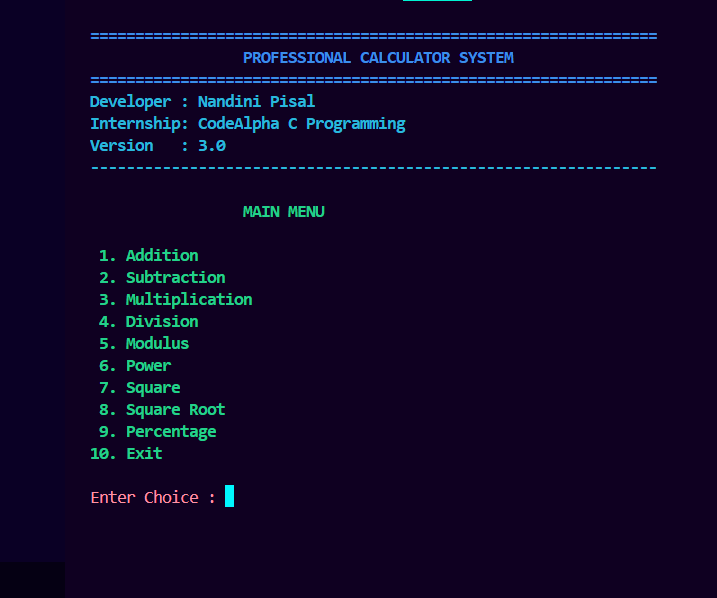

# 🧮 CodeAlpha Calculator

A professional **menu-driven calculator application** developed in **C Programming** as part of the **CodeAlpha C Programming Internship**.

The project demonstrates the implementation of fundamental C programming concepts such as functions, switch-case statements, modular programming, mathematical operations, and user interaction through a clean console interface.

---

# 📌 Project Overview

This calculator performs common arithmetic and mathematical operations through a user-friendly menu-driven interface. The project is divided into multiple source files to improve code readability, maintainability, and modularity.

---

# ✨ Features

* ➕ Addition
* ➖ Subtraction
* ✖️ Multiplication
* ➗ Division
* 🧮 Modulus
* 🔢 Power Calculation
* ⬛ Square
* √ Square Root
* 📊 Percentage Calculation
* ⚠️ Division by Zero Handling
* ⚠️ Invalid Input Handling
* 📋 Menu-Driven Interface
* 🧩 Modular Programming Structure

---

# 📂 Project Structure

```
CodeAlpha_Calculator/
│
├── main.c
├── ui.c
├── ui.h
├── operations.c
├── operations.h
├── colors.h
├── README.md
├── LICENSE
├── .gitignore
└── screenshots/
```

---

# 🛠️ Technologies Used

* C Programming
* GCC Compiler (MinGW-w64)
* Visual Studio Code
* Windows Terminal / PowerShell

---

# 📚 C Programming Concepts Used

* Functions
* Header Files
* Modular Programming
* Switch Case
* Loops
* Conditional Statements
* Mathematical Library (`math.h`)
* User Input & Output
* Error Handling

---

# ▶️ How to Compile

Open the project folder in Visual Studio Code and run:

```bash
gcc main.c ui.c operations.c -o calculator.exe -lm
```

---

# ▶️ How to Run

```bash
.\calculator.exe
```

---

# 📸 Screenshots

### Main Menu



### Addition


### Exit


---

# 🚀 Future Improvements

* Calculation History
* Scientific Calculator Functions
* File-Based History Storage
* Enhanced User Interface
* Cross-Platform Support
* Input Validation Improvements

---

# 🎯 Learning Outcomes

Through this project, I strengthened my understanding of:

* Modular C Programming
* Header File Management
* Function Design
* Console-Based User Interface
* Mathematical Computation
* Error Handling
* Code Organization

---

# 👩‍💻 Developer

**Nandini Pisal**

B.Tech Computer Science Engineering Student

CodeAlpha C Programming Internship

---

# 📄 License

This project is developed for educational purposes as part of the **CodeAlpha Internship Program**.
